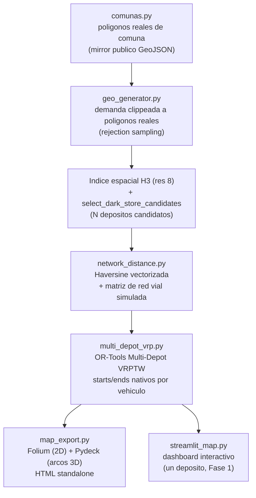

[ 🇺🇸 [Read in English](README.md) ] | [ 🇨🇱 Español ]

# 🚚 Chile Spatial Logistics Optimizer


Sistema de Inteligencia Geoespacial para optimizar la ubicación de **Dark Stores** y las rutas de **entrega de última milla** en la Región Metropolitana de Santiago, Chile.

**Fase 1** implementó el pipeline completo de un solo depósito: demanda sintética → indexación espacial H3 → selección de celdas candidatas a Dark Store → VRP con capacidad y ventanas de tiempo → dashboard interactivo.

**Fase 2** (esta actualización) reemplaza tres de las simplificaciones que la propia Fase 1 documentaba como pendientes: polígonos reales de comuna en vez de círculos, una matriz de distancias por red vial simulada en vez de línea recta, y un VRPTW multi-depósito genuino resuelto conjuntamente en vez de un depósito a la vez — más exportación de mapas HTML standalone (Folium + Pydeck) y un notebook de evaluación complementario.

## 1. Arquitectura



## 2. Decisiones de diseño

- **Polígonos reales de comuna, no círculos**: `src/spatial/comunas.py` carga los límites administrativos reales de las 5 comunas objetivo (Las Condes, Providencia, Santiago Centro, Maipú, San Bernardo) desde un mirror público en GitHub de la cartografía comunal oficial de la Región Metropolitana (ver §7, Fuentes de datos). `generate_demand_within_polygons` usa rejection sampling — sortea un punto dentro del bounding box del polígono, lo conserva solo si cae realmente dentro del polígono real — así que todo pedido generado está garantizado de caer dentro del límite real de su comuna, a diferencia de la aproximación circular de Fase 1 (que podía ubicar un punto en la comuna vecina).
- **Distancia por red vial simulada, no un servidor OSRM real**: levantar OSRM de verdad requiere un extracto `.osm.pbf` de la red vial (cientos de MB) más un preprocesamiento (`osrm-extract`/`osrm-contract`) — infraestructura que este proyecto no necesita para demostrar que el motor de ruteo puede consumir *cualquier* matriz de distancias, no solo línea recta. En su lugar, `src/spatial/network_distance.py` aplica un **factor de circuidad** (distancia por calles ÷ distancia en línea recta, rango típico de literatura 1,15–1,35 dentro de una zona, 1,25–1,55 cruzando zonas) sobre una matriz Haversine vectorizada — declarado explícitamente como simulado, nunca presentado como una consulta OSRM real, y construido para que la distancia por calles nunca sea menor que la distancia en línea recta (un invariante físico, verificado directamente con un test).
- **"Haversine acelerada"**: la implementación vectorizada con NumPy reemplaza el doble loop en Python puro O(n²) de Fase 1, con un speedup medido (no solo afirmado) — ver §6.
- **Multi-Depot VRPTW real, no pre-clustering**: `src/optimization/multi_depot_vrp.py` usa el soporte nativo de OR-Tools para múltiples `starts`/`ends` de vehículo (`RoutingIndexManager(n, num_vehicles, starts, ends)`), así que el solver decide *conjuntamente* qué vehículo — de qué depósito — atiende cada parada, en una sola optimización. Esto importa: pre-asignar cada celda de demanda a su depósito más cercano antes de rutear puede dejar la flota de un depósito sobrecargada mientras un depósito más lejano con capacidad libre queda ocioso; resolver conjuntamente evita esa falla por construcción.
- **Exportación de mapas standalone, no solo un dashboard en la app**: `src/spatial/map_export.py` colorea las rutas por depósito (no por vehículo) — la pregunta que motiva la optimización multi-depósito es sobre el balance de carga *entre depósitos*, así que esa es la agrupación visual que importa — a un archivo HTML autocontenido, abrible sin correr Streamlit.

## 3. Estructura del proyecto

```
chile-spatial-logistics-opt/
├── data/
│   ├── raw/
│   │   └── comunas_rm_subset.geojson     # poligonos reales de comuna (comiteado, ~25KB)
│   └── processed/                         # datasets generados (CSV / GeoJSON)
├── src/
│   ├── spatial/
│   │   ├── comunas.py                     # carga/descarga de poligonos reales de comuna
│   │   ├── geo_generator.py               # demanda sintetica (variante circulo + poligono real), indexacion H3
│   │   ├── network_distance.py            # Haversine vectorizada + matriz de red vial simulada
│   │   └── map_export.py                  # exportacion HTML standalone Folium + Pydeck
│   ├── optimization/
│   │   ├── vrp_solver.py                  # VRPTW de un deposito (Fase 1)
│   │   └── multi_depot_vrp.py             # VRPTW multi-deposito (Fase 2)
│   └── app/
│       └── streamlit_map.py               # dashboard interactivo (un deposito)
├── 02_MultiDepot_VRPTW_OSRM.ipynb          # ejecutado, salidas reales
├── outputs/
│   └── maps/                              # 2 mapas de ejemplo comiteados (Folium + Pydeck)
├── tests/
├── scripts/
│   └── auto_push.py                       # helper de git add/commit/push
├── requirements.txt
├── README.md
└── README.es.md
```

## 4. Instalación

```powershell
python -m venv venv
venv\Scripts\activate
pip install -r requirements.txt
```

> **Nota (Windows):** `geopandas`/`pyogrio` dependen de binarios GDAL. Si `pip install` falla al compilar, usa Conda como alternativa: `conda install -c conda-forge geopandas h3-py ortools`.

## 5. Uso

### 1. Generar el dataset de demanda + índice H3

```powershell
python -m src.spatial.geo_generator
```

### 2. (Opcional) Re-descargar los polígonos reales de comuna

```powershell
python -m src.spatial.comunas
```

Solo hace falta para regenerar `data/raw/comunas_rm_subset.geojson` desde la fuente pública original — el archivo ya está comiteado, así que el pipeline corre completamente offline sin este paso.

### 3. Resolver un VRP de un solo depósito (Fase 1)

```powershell
python -m src.optimization.vrp_solver
```

### 4. Correr el notebook Multi-Depot VRPTW (Fase 2)

```powershell
jupyter nbconvert --to notebook --execute --inplace 02_MultiDepot_VRPTW_OSRM.ipynb
# o abrirlo interactivamente:
jupyter notebook 02_MultiDepot_VRPTW_OSRM.ipynb
```

Genera demanda dentro de polígonos reales de comuna, selecciona 3 depósitos candidatos, construye la matriz de distancias por red vial simulada, resuelve el VRPTW multi-depósito conjunto, muestra el gráfico de balance de carga por depósito, y exporta los mapas Folium y Pydeck a `outputs/maps/`.

### 5. Levantar el dashboard interactivo (un depósito)

```powershell
streamlit run src/app/streamlit_map.py
```

### 6. Ejecutar los tests

```powershell
pytest
```

### 7. Sincronizar con GitHub

```powershell
python scripts/auto_push.py -m "mensaje de commit"
```

## 6. Resultados

Todos los números de abajo vienen de una corrida real de `02_MultiDepot_VRPTW_OSRM.ipynb` (semilla 42) — nada acá es estimado.

| Métrica | Valor |
|---|---|
| Polígonos reales de comuna cargados | 5 (Las Condes, Providencia, Santiago Centro, Maipú, San Bernardo) |
| Puntos de demanda generados (clippeados a polígonos reales) | 225 |
| Celdas H3 con demanda (resolución 8) | 173 |
| Demanda total | 1.025 unidades |
| Depósitos candidatos seleccionados | 3 |
| Speedup Haversine (vectorizada vs. loop puro en Python, 173 ubicaciones) | **28,7x** (43,49ms → 1,51ms) |
| Distancia total del VRPTW multi-depósito (red vial simulada) | 503,90 km |
| Vehículos usados | 8 / 9 disponibles |
| Celdas de demanda sin asignar | 0 |
| Suite de tests | 40/40 pasando (`pytest`) |

**Nota honesta sobre la selección de depósitos**: 2 de las 3 celdas H3 de mayor demanda seleccionadas como depósitos candidatos caen dentro de Santiago Centro (ubicaciones específicas distintas, misma comuna) — un resultado real y no forzado de elegir las celdas de mayor demanda en vez de una por comuna por diseño. Es un resultado realista para un centro urbano denso (varios dark stores en la misma comuna es un modelo operativo legítimo), no un bug, y no se suavizó hacia un ejemplo artificialmente "diverso".

## 7. Fuentes de datos

- **Polígonos reales de comuna**: `data/raw/comunas_rm_subset.geojson`, filtrado de un mirror público en GitHub de los límites comunales oficiales de la Región Metropolitana (en última instancia, la base cartográfica INE/SII de Chile): [caracena/chile-geojson](https://github.com/caracena/chile-geojson), archivo `13.geojson` (región 13 = Región Metropolitana). Ese mirror no declara una licencia explícita; el dato subyacente de límites administrativos es información pública chilena. Ver `src/spatial/comunas.py` para el script de descarga/filtrado usado para regenerar este archivo desde la fuente.
- **Distancias por red vial**: simuladas, no una consulta OSRM real — ver §2. Declarado explícitamente, no presentado como salida real de un motor de ruteo.
- **Demanda y pedidos**: completamente sintéticos (generador propio, con semilla, determinístico).

## 8. Testing

```powershell
pytest -v
```

40 tests: integridad de los polígonos reales (validez, CRS, límites plausibles), corrección del clipping punto-en-polígono-real (cada punto generado verificado vía spatial join de que efectivamente cae dentro de su comuna asignada, no solo dentro de su bounding box), equivalencia numérica Haversine vectorizada vs. loop, invariantes físicos de la distancia por red vial (nunca menor que la línea recta, simétrica, determinística dada una semilla, mayor circuidad promedio en viajes inter-zona), validación de la instancia multi-depósito (rechaza demanda de depósito distinta de cero, conteos de vehículos/depósitos no coincidentes, matrices de distancia con forma incorrecta), corrección de la solución multi-depósito (cada ruta empieza y termina en su propio depósito, la demanda cercana es atendida por el depósito cercano, los resúmenes por depósito suman el total de la solución), y smoke tests de exportación de mapas (los archivos HTML de Folium y Pydeck se crean con contenido real).

## 9. Próximos pasos

- Optimización de facility-location para *dónde* ubicar los depósitos candidatos (no solo qué celdas H3 de mayor demanda elegir), conjuntamente con la decisión de ruteo.
- Persistencia de escenarios de optimización y comparación de métricas entre corridas.
- Una instancia real de OSRM (Docker + un extracto `.osm.pbf` de Santiago) como reemplazo directo de la matriz de red vial simulada, detrás de la misma interfaz `distance_matrix_km` que `multi_depot_vrp.py` ya espera.
- Extender el dashboard multi-depósito (Streamlit) para igualar las capacidades del notebook, no solo la UI de un depósito de Fase 1.

## Licencia

MIT — ver [LICENSE](LICENSE).

## Autor

**Pablo Reyes** — [github.com/Rxyxs](https://github.com/Rxyxs)
