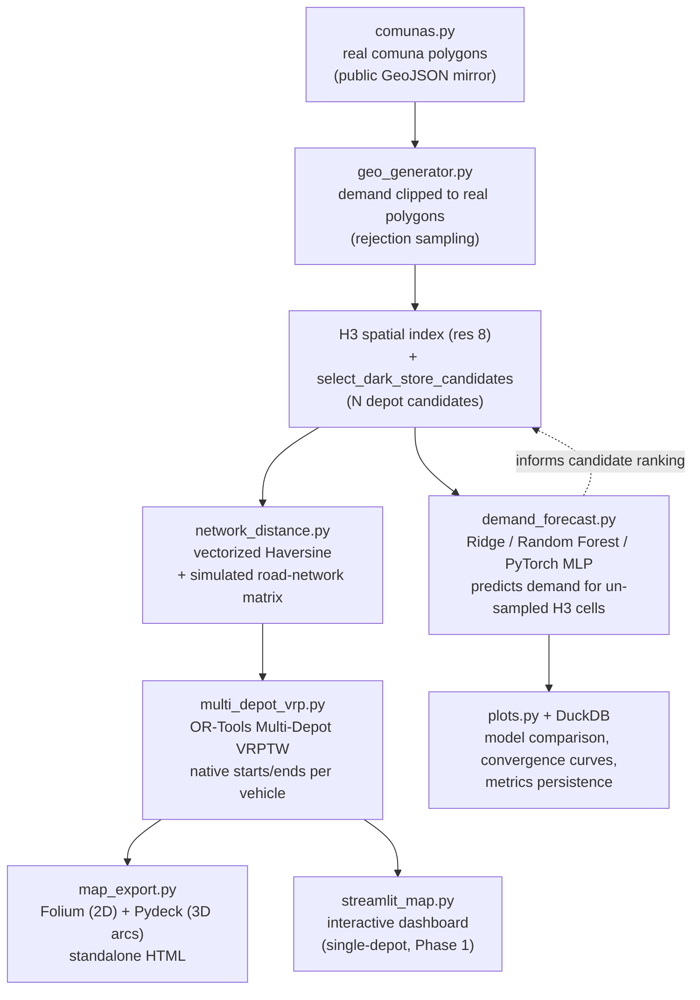
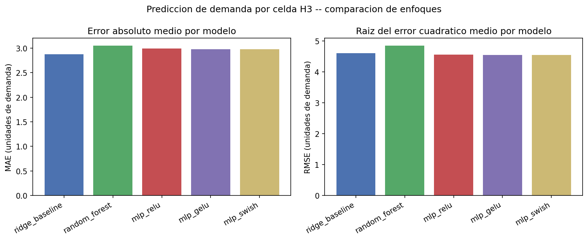
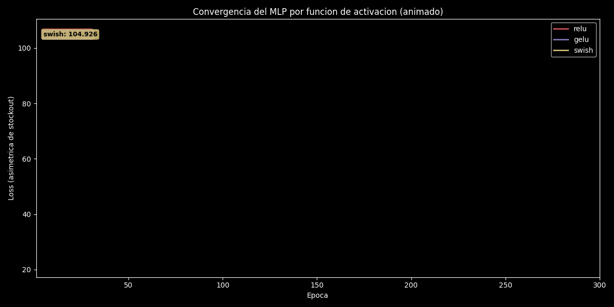
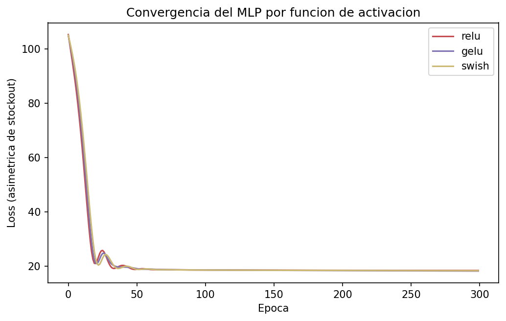
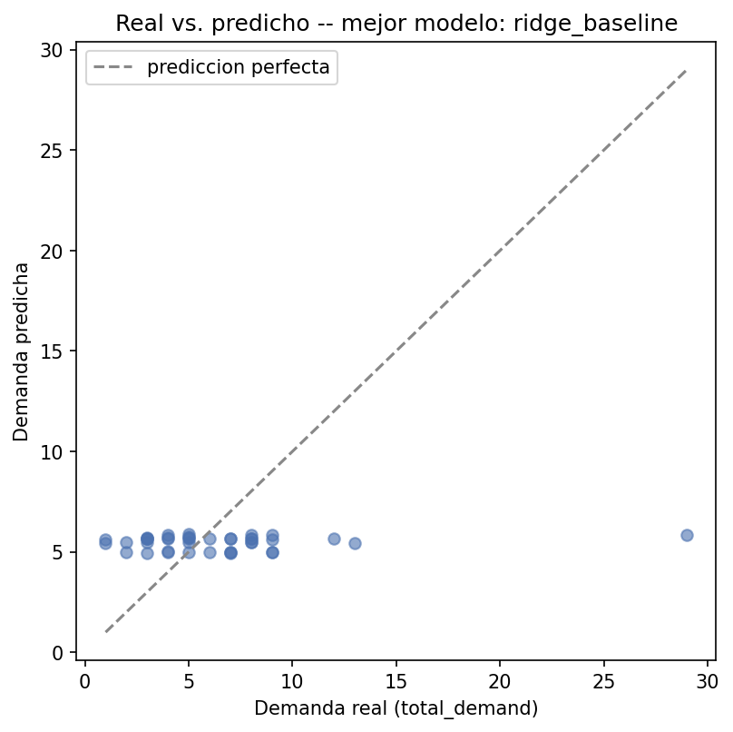

[ 🇺🇸 English ] | [ 🇨🇱 [Español](README.es.md) ]

# 🚚 Chile Spatial Logistics Optimizer


Geospatial intelligence system for **Dark Store** siting and **last-mile delivery** route optimization in Santiago, Chile's Metropolitan Region.

**Phase 1** built the full single-depot pipeline: synthetic demand → H3 spatial indexing → Dark Store candidate selection → VRP with capacity and time windows → interactive dashboard.

**Phase 2** replaces three of Phase 1's own documented simplifications with the real thing: real comuna polygons instead of circles, a simulated road-network distance matrix instead of straight-line distance, and a genuine multi-depot VRPTW solved jointly instead of one depot at a time — plus standalone HTML map export (Folium + Pydeck) and a companion evaluation notebook.

**Phase 3** (this update) adds a **demand-forecasting module** as an upstream input to the siting/routing decision, not a replacement for it: given only a candidate H3 cell's comuna and centroid coordinates (the information available for a site that has no order history yet), predict its expected demand. Three approaches are compared — a Ridge regression baseline, a Random Forest ensemble, and a PyTorch MLP trained with a custom asymmetric loss (penalizing under-prediction more than over-prediction, since a Dark Store stockout is costlier than idle capacity) — across three activation functions (ReLU, GELU, Swish/SiLU). Metrics are persisted to DuckDB and the comparison plots are versioned in `outputs/plots/`.

## 0.1 Business Impact & Key Performance Indicators

| Metric | Result | What it means |
|---|---|---|
| Multi-depot VRPTW, unassigned demand cells | **0** / 173 | Every H3 demand cell served, jointly optimized vehicle-to-depot-to-stop assignment |
| Fleet utilization | 8 / 9 vehicles used | Total simulated route distance: 503.90 km |
| Haversine distance-matrix speedup | **28.7x** (43.49ms → 1.51ms) | Vectorized NumPy vs. pure-Python loop, measured not claimed |
| Real comuna polygons | 5 comunas, 225 demand points | Rejection-sampled so every point genuinely falls inside its real polygon, not a bounding box |
| Test suite | 55/55 passing | Grown from Phase 1's 13 tests to cover polygon containment, network-distance invariants, multi-depot assignment, and demand forecasting |
| Demand forecast, best model MAE | 2.87 (Ridge) | Predicts H3-cell demand from location only, as an input to depot-siting candidate ranking |

## 1. Architecture



## 2. Design decisions

- **Real comuna polygons, not circles**: `src/spatial/comunas.py` loads real administrative boundaries for the 5 target comunas (Las Condes, Providencia, Santiago Centro, Maipú, San Bernardo) from a public GeoJSON mirror of Chile's official communal cartography (see §7, Data sources). `generate_demand_within_polygons` uses rejection sampling — draw a point inside the polygon's bounding box, keep it only if it's actually inside the real polygon — so every generated order is guaranteed to fall within its comuna's real boundary, unlike Phase 1's circle approximation (which could place a point in a neighboring comuna).
- **Simulated road-network distance, not a live OSRM server**: standing up real OSRM requires a `.osm.pbf` road-network extract (hundreds of MB) plus a preprocessing pipeline (`osrm-extract`/`osrm-contract`) — infrastructure this project doesn't need to demonstrate that the routing engine can consume *any* distance matrix, not just straight-line. Instead, `src/spatial/network_distance.py` applies a **circuity factor** (road distance ÷ straight-line distance, literature-typical range 1.15–1.35 within a zone, 1.25–1.55 crossing zones) on top of a vectorized Haversine matrix — explicitly disclosed as simulated, never claimed to be a real OSRM query, and built so road distance is never shorter than straight-line distance (a physical invariant, tested directly).
- **"Accelerated Haversine"**: the vectorized NumPy implementation replaces Phase 1's O(n²) pure-Python double loop, with a measured (not claimed) speedup — see §6.
- **True multi-depot VRPTW, not pre-clustering**: `src/optimization/multi_depot_vrp.py` uses OR-Tools' native support for multiple vehicle `starts`/`ends` (`RoutingIndexManager(n, num_vehicles, starts, ends)`), so the solver decides *jointly* which vehicle — from which depot — serves which stop, in a single optimization. This matters: pre-assigning each demand cell to its nearest depot before routing can leave one depot's fleet overloaded while a farther depot with spare capacity sits idle; solving jointly avoids that failure mode by construction.
- **Standalone map export, not just an in-app dashboard**: `src/spatial/map_export.py` renders routes colored by depot (not by vehicle) — the question multi-depot optimization exists to answer is about load balance *between depots*, so that's the visual grouping that matters — to a self-contained HTML file, openable without running Streamlit.
- **Demand forecasting as an input to siting, not a replacement for the optimizer**: `src/prediction/demand_forecast.py` predicts `total_demand` for an H3 cell from location alone (comuna + centroid lat/lon) — deliberately excluding `order_count`, which wouldn't exist yet for a genuinely new candidate site. The output is meant to feed `select_dark_store_candidates`, not to replace the VRP solver.
- **Asymmetric loss for the neural model**: `AsymmetricStockoutLoss` weights under-prediction 2.5x over-prediction, because under-sizing a Dark Store's expected demand risks a stockout (lost sales, unhappy customers), while over-sizing only costs idle capacity — a domain-specific asymmetry a plain MSE loss ignores.
- **Three activations compared, not assumed**: ReLU, GELU, and Swish (`nn.SiLU`) are trained on identical data/seed/architecture so the convergence and accuracy differences in `outputs/plots/mlp_activation_convergence.png` reflect the activation choice alone.

## 3. Project structure

```
chile-spatial-logistics-opt/
├── data/
│   ├── raw/
│   │   └── comunas_rm_subset.geojson     # real comuna polygons (committed, ~25KB)
│   └── processed/                         # generated datasets (CSV / GeoJSON)
├── src/
│   ├── spatial/
│   │   ├── comunas.py                     # real comuna polygon loading/fetching
│   │   ├── geo_generator.py               # synthetic demand (circle + real-polygon variants), H3 indexing
│   │   ├── network_distance.py            # vectorized Haversine + simulated road-network matrix
│   │   └── map_export.py                  # Folium + Pydeck standalone HTML export
│   ├── optimization/
│   │   ├── vrp_solver.py                  # single-depot VRPTW (Phase 1)
│   │   └── multi_depot_vrp.py             # multi-depot VRPTW (Phase 2)
│   ├── prediction/
│   │   ├── demand_forecast.py             # Ridge / Random Forest / PyTorch MLP demand forecasting (Phase 3)
│   │   └── plots.py                       # comparison / convergence / actual-vs-predicted plots
│   └── app/
│       └── streamlit_map.py               # interactive dashboard (single-depot)
├── 02_MultiDepot_VRPTW_OSRM.ipynb          # executed, real outputs
├── outputs/
│   ├── maps/                              # 2 committed example maps (Folium + Pydeck)
│   ├── plots/                             # 3 committed example plots (demand forecasting)
│   └── metrics/                           # DuckDB store for demand-forecast metrics (local, not versioned)
├── tests/
├── scripts/
│   └── auto_push.py                       # git add/commit/push helper
├── requirements.txt
├── README.md
└── README.es.md
```

## 4. Installation

```powershell
python -m venv venv
venv\Scripts\activate
pip install -r requirements.txt
```

> **Windows note:** `geopandas`/`pyogrio` depend on GDAL binaries. If `pip install` fails to build, use Conda instead: `conda install -c conda-forge geopandas h3-py ortools`.

## 5. Usage

### 1. Generate the demand dataset + H3 index

```powershell
python -m src.spatial.geo_generator
```

### 2. (Optional) Re-fetch the real comuna polygons

```powershell
python -m src.spatial.comunas
```

Only needed to regenerate `data/raw/comunas_rm_subset.geojson` from the original public source — the committed file is already there, so the pipeline runs fully offline without this step.

### 3. Solve a single-depot VRP (Phase 1)

```powershell
python -m src.optimization.vrp_solver
```

### 4. Run the Multi-Depot VRPTW notebook (Phase 2)

```powershell
jupyter nbconvert --to notebook --execute --inplace 02_MultiDepot_VRPTW_OSRM.ipynb
# or open it interactively:
jupyter notebook 02_MultiDepot_VRPTW_OSRM.ipynb
```

Generates demand within real comuna polygons, selects 3 depot candidates, builds the simulated road-network distance matrix, solves the joint multi-depot VRPTW, shows the per-depot load-balance chart, and exports both the Folium and Pydeck maps to `outputs/maps/`.

### 5. Launch the interactive dashboard (single-depot)

```powershell
streamlit run src/app/streamlit_map.py
```

### 5b. Run the demand-forecasting comparison (Phase 3)

```powershell
python -m src.prediction.demand_forecast
```

Trains Ridge, Random Forest, and a PyTorch MLP (ReLU/GELU/Swish) on the H3 demand aggregation, prints MAE/RMSE/R² per model, persists them to `outputs/metrics/demand_forecast_metrics.duckdb`, and regenerates the 3 plots in `outputs/plots/`.

### 6. Run the tests

```powershell
pytest
```

### 7. Sync with GitHub

```powershell
python scripts/auto_push.py -m "commit message"
```

## 6. Results

Every number below comes from an actual run of `02_MultiDepot_VRPTW_OSRM.ipynb` (seed 42) — nothing here is estimated.

| Metric | Value |
|---|---|
| Real comuna polygons loaded | 5 (Las Condes, Providencia, Santiago Centro, Maipú, San Bernardo) |
| Demand points generated (clipped to real polygons) | 225 |
| H3 cells with demand (resolution 8) | 173 |
| Total demand | 1,025 units |
| Depot candidates selected | 3 |
| Haversine speedup (vectorized vs. pure-Python loop, 173 locations) | **28.7x** (43.49ms → 1.51ms) |
| Multi-Depot VRPTW total distance (simulated road network) | 503.90 km |
| Vehicles used | 8 / 9 available |
| Unassigned demand cells | 0 |
| Test suite | 40/40 passing (`pytest`) |

### 6.1 Demand forecasting (Phase 3) -- model comparison

Every number below comes from an actual run of `python -m src.prediction.demand_forecast` (seed 42) on the H3 demand aggregation described above (158 cells, 75%/25% train/test split).

| Model | MAE | RMSE | R² |
|---|---|---|---|
| Ridge baseline (interpretable) | 2.87 | 4.60 | -0.01 |
| Random Forest (ensemble) | 3.05 | 4.85 | -0.13 |
| PyTorch MLP -- ReLU | 2.99 | 4.55 | 0.01 |
| PyTorch MLP -- GELU | 2.98 | 4.54 | 0.01 |
| PyTorch MLP -- Swish (SiLU) | 2.97 | 4.54 | 0.01 |


The animated version below traces the loss curves epoch by epoch, with a floating label tracking each activation's current loss.





**Honest note on forecasting accuracy**: R² near zero across all five models is the correct, un-massaged result here — `total_demand` in the synthetic generator is drawn independently of location (`rng.randint(min_demand, max_demand)` per order, uncorrelated with comuna or coordinates by construction), so there is little real spatial signal to learn from location alone. The comparison is still meaningful as a **methodology demonstration** — three genuinely different model families, a domain-specific asymmetric loss, and an honest activation comparison — that would show a real accuracy gap on demand data with actual spatial structure (seasonality, comuna-level income/population correlates, proximity to transit), which this synthetic generator doesn't model.

**Honest note on depot selection**: 2 of the 3 top-demand H3 cells selected as depot candidates both fall within Santiago Centro (different specific locations, same comuna) — a real, un-forced result of picking the highest-demand cells rather than one-per-comuna by design. It's a realistic outcome for a dense urban core (multiple dark stores in the same comuna is a legitimate operating model), not a bug, and not smoothed over into an artificially "diverse" example.

## 7. Data sources

- **Real comuna polygons**: `data/raw/comunas_rm_subset.geojson`, filtered from a public GitHub mirror of the Metropolitan Region's official communal boundaries (ultimately Chile's INE/SII cartographic base): [caracena/chile-geojson](https://github.com/caracena/chile-geojson), file `13.geojson` (region 13 = Región Metropolitana). No explicit license is stated on that mirror; the underlying administrative-boundary data itself is Chilean public information. See `src/spatial/comunas.py` for the fetch/filter script used to regenerate this file from source.
- **Road-network distances**: simulated, not a live OSRM query — see §2. Disclosed explicitly, not presented as real routing-engine output.
- **Demand and orders**: fully synthetic (own generator, seeded, deterministic).

## 8. Testing

```powershell
pytest -v
```

55 tests: real-polygon integrity (validity, CRS, plausible bounds), point-in-real-polygon clipping correctness (every generated point verified via spatial join to be inside its assigned comuna, not just its bounding box), vectorized-vs-loop Haversine numerical equivalence, road-network-distance physical invariants (never shorter than straight-line, symmetric, deterministic given a seed, higher circuity for inter-zone trips on average), multi-depot instance validation (rejects nonzero depot demand, mismatched vehicle/depot counts, wrong-shaped distance matrices), multi-depot solution correctness (every route starts and ends at its own depot, nearby demand is served by the nearby depot, per-depot summaries sum to the solution total), map-export smoke tests (both Folium and Pydeck HTML files are created with real content), demand-forecast feature/metric correctness (no leakage of `order_count`, MAE/RMSE/R² sanity on a perfect prediction), the asymmetric loss actually penalizing under-prediction more than over-prediction, MLP training loss decreasing across all 3 activations, DuckDB metrics persistence (including idempotent overwrite on rerun of the same `run_label`), and plot-generation smoke tests for all 3 demand-forecast figures.

## 9. Future work

- Facility-location optimization for *where* to place depot candidates (not just which top-demand H3 cells to pick), jointly with the routing decision.
- Feed `demand_forecast.py`'s predicted demand directly into `select_dark_store_candidates`, so un-sampled H3 cells can be ranked as depot candidates without waiting for real order history.
- Demand data with genuine spatial structure (comuna-level income/population, transit proximity, seasonality) to give the model comparison a real accuracy gap to demonstrate, not just a methodology one.
- Persist optimization scenarios and compare metrics across runs.
- A real OSRM instance (Docker + a Santiago `.osm.pbf` extract) as a drop-in replacement for the simulated road-network matrix, behind the same `distance_matrix_km` interface `multi_depot_vrp.py` already expects.
- Extend the multi-depot dashboard (Streamlit) to match the notebook's capabilities, not just the single-depot Phase 1 UI.

## License

MIT — see [LICENSE](LICENSE).

## Author

**Pablo Reyes** — [github.com/Rxyxs](https://github.com/Rxyxs)
